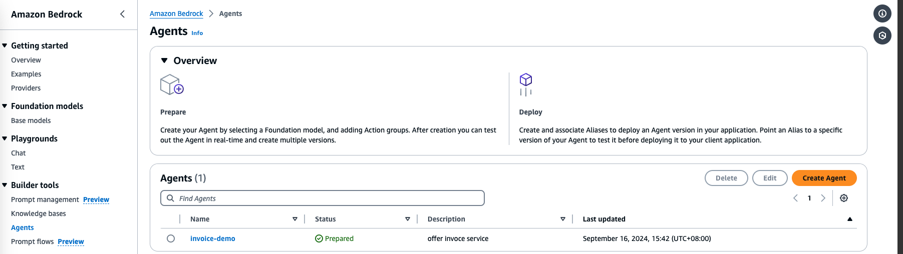
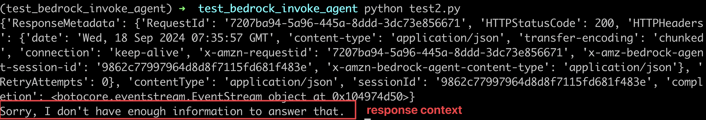

Install the packages required by these examples by running the following in a virtual environment:

```
python -m pip install -r requirements.txt
```

Run the examples:
```
python code_generation.py
```

You should already create an agent in Bedrock


The result of agent invocation
