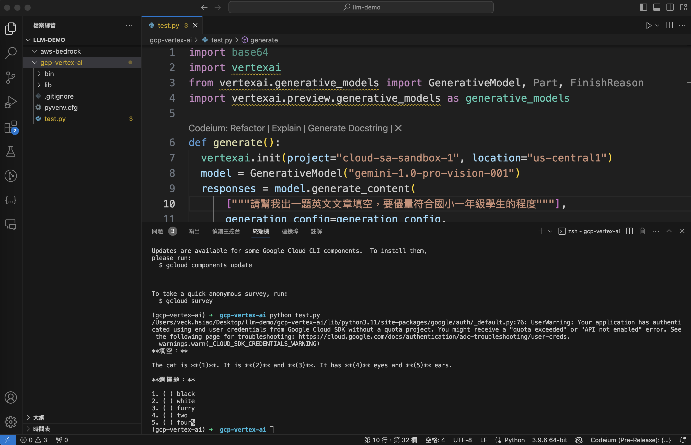

Install the Vertex AI SDK: Open a terminal window and enter the command below. You can also install it in a virtualenv 

```
pip install --upgrade google-cloud-aiplatform
gcloud auth application-default login
```

The result of test.py

